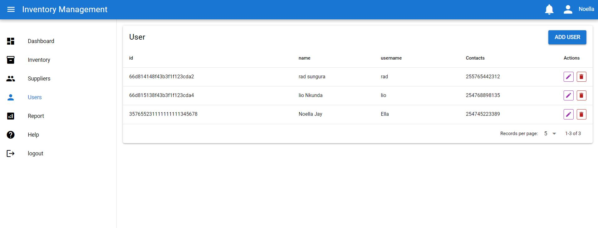

# inventAPI

# Introduction

inventAPI is a backend API designed for inventory systems. It provides CRUD operations for managing Users, Clients, Suppliers, and Products in a web-based environment.

1.Our API is deployed on : https://inventapi.onrender.com,

2.used with this app: https://e-inventory.onrender.com/products, 

3.Authors LinkedIn:

    1. Noella JAREGA, https://www.linkedin.com/in/noella-jarega-a308261b9/

    2. Aime RUKUNDO, https://www.linkedin.com/in/aimeruk/

# Installation

This API is web-based, meaning there is no installation required. You can clone the repository and use it for your own purposes.

# Usage 

Our API is not currently public. However, if you would like to use it, you are welcome to clone this repository and run it locally.

To clone the repository:
bash

Copy code

git clone https://github.com/yourusername/inventAPI.git

run npm install

install mongodb

Once cloned, ensure that you have all the necessary dependencies and environment variables set up for your local environment
Change the database url in db.js to your own.

# API Endpoints

Below are the key endpoints for interacting with the API:

/users: CRUD operations for managing users.

/clients: CRUD operations for managing clients.

/suppliers: CRUD operations for managing suppliers.

/products: CRUD operations for managing products.

# Technologies Used

Node.js: JavaScript runtime environment.

Express: Web framework for Node.js.

MongoDB: NoSQL database for storing data.

Cors: Middleware for enabling CORS (Cross-Origin Resource Sharing).

# Contributing

We welcome contributions from anyone interested in improving this API. Feel free to open issues, submit pull requests, or suggest enhancements.

# Related projects
Our project is a portofolio project one of the ALX Africa Program project  

# Licensing

This project is licensed under the MIT License, meaning it is open-source and free to use.

# Story

Across Africa, businesses of all sizesfrom local shops to large wholesalersare the lifeblood of vibrant, growing economies. Yet, one of the biggest challenges they face is efficiently managing inventory. Whether it’s a market vendor in Lagos selling handcrafted goods, a farmer in Uganda managing crop supplies, or a shop owner in Johannesburg keeping up with customer demand, inventory management is critical to staying competitive.

In many cases, businesses still rely on manual methods, like handwritten records or simple spreadsheets, to track their stock. These methods are prone to errors, and they can make it difficult to keep up with the fastmoving nature of trade in Africa’s bustling cities and rural communities.

This is where an inventory management system can be a game changer. Imagine a local store owner in Accra who imports goods from suppliers and sells to both regular customers and other businesses. With an inventory system, they can easily track stock levels, automate reorders, and keep detailed records of every transaction—all while reducing the risk of stockouts or overstocking.

For farmers in agricultural regions, an inventory system helps them better manage the flow of seeds, fertilizers, and harvested crops. It provides realtime updates on available supplies, ensures that nothing goes to waste, and helps them plan more effectively for the seasons ahead.

From urban centers like Nairobi to rural towns, an inventory system helps African businesses optimize their operations, cut down on waste, and maintain a steady supply of products. By automating stock management and providing insights into supply and demand, these systems allow businesses to focus more on growth and less on manual tracking.

In Africa’s rapidly evolving economies, efficiency is key. An inventory management system not only saves time and reduces errors but also helps businesses stay ahead by ensuring they have the right products at the right time, whether they’re dealing with local or international suppliers.

By adopting modern inventory systems, African businesses can improve their competitiveness, streamline operations, and play an even bigger role in the continent’s economic growth.

Thank you for using inventAPI! 🙌